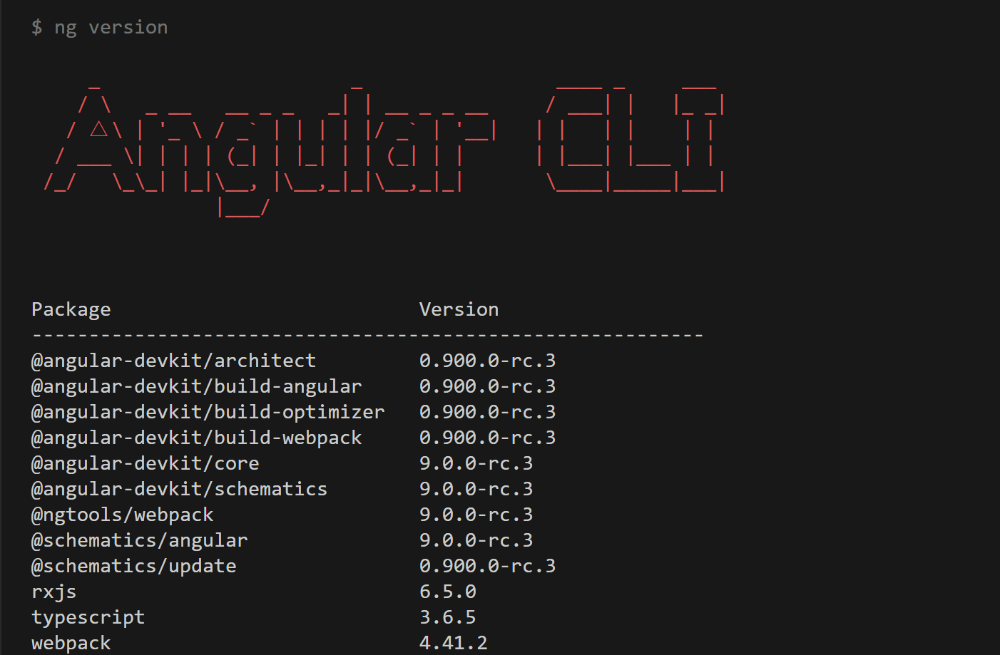

# AngularPinduoduo

## clone to the local
Clone the repo to local

## ng version


## server

```shell
node server
```
The local server will open at the port 8082

## front end

```shell
yarn
```

```shell
yarn start
```

```shell
yarn build
```

## demo play


